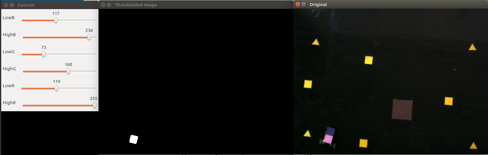

This program will make trackbars, so that one can choose color-range of the object to detect.

Sample output:

`The values are (LowB, LowG, LowR), (HighB, HighG, HighR): (117, 73, 119), (236, 160, 255)`

To buid:
	chmod +x make.sh
	./make.sh

To run:
	./color_range

Sample screenshot: 

